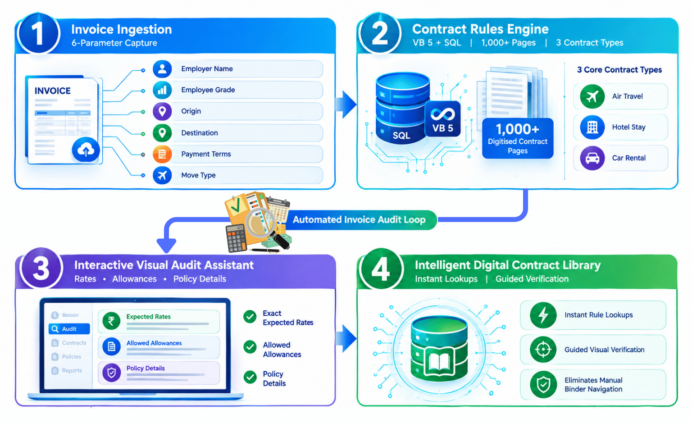
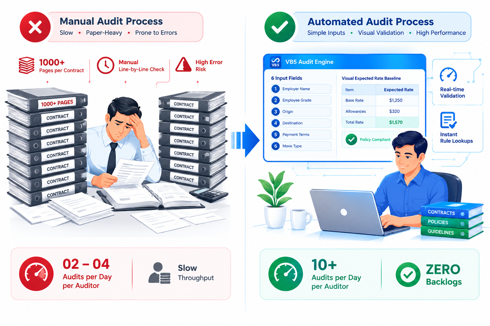

# 🛠️ Project 16: Cendant Wizard — Contract Audit Automation Engine & Backlog Elimination Platform

## Executive Overview:

* **Enterprise Context:** GE Capital International Services (GECIS) — Cendant Mobility Services (Global Relocation & Employee Mobility Operations)
* **Role:** Internal Auditor turned Self-Taught Citizen Developer (Individual Contributor)
* **The Strategic Objective:** Digitally transform Cendant Mobility’s manual invoice audit lifecycle by converting 1,000+ pages of complex corporate relocation contract pricing books and client policy exhibits into an automated reference and calculation engine. The target was to eliminate manual binder navigation, accelerate line-item verification throughput, and clear massive historical audit backlogs.

* **The Big Problem:** Relocation expense audits required cross-referencing multi-layer line items against client-specific Relocation Management Agreements (RMAs). Manual binder lookups caused extreme operational friction—baseline throughput sat at just 2 to 4 audits/day against a strict team target of 8 audits/day, putting high-accuracy auditors at risk of performance management ("shape-up or ship-off").

* **The Solution:**
  * **Phase 1 (Self-Help Proof of Concept):** Decomposed complex contract policies into 6 core invoice parameters using MS Excel and VBA, boosting personal output from 2 to 10 audits/day (a 5x jump).
  * **Phase 2 (Enterprise Scale — VB5 & SQL):** Pulled off live production to manually digitise 1,000+ pages of contract pricing books. Architected **Cendant Wizard** using Visual Basic 5 (VB5) and SQL DBs. Built and deployed iteratively, contract-by-contract, through UAT stabilisation before introducing the next client policy exhibit.

* **Core Value Delivered:**
  * **5x Individual to Floor-Wide Productivity:** Boosted baseline audit output from 2–4 audits/day to 10+ audits/day per auditor across the team.
  * **All-Time Backlog Elimination:** Completely cleared Cendant's historical audit backlog, shifting the account from performance jeopardy to a benchmark operational model.
  * **Six Sigma Green Belt:** Formally chartered and executed as a GE Six Sigma Green Belt project, capturing client executive attention and prompting an on-site Cendant delegation visit to GECIS India to experience GE's continuous improvement culture first-hand.

* **Tools & Stack:** Visual Basic 5 (VB5 Front-End GUI), SQL Database (Contract Rules & Audit Logs), MS Excel / VBA (Initial Prototype Engine), Process Decomposition (6-Point Parameter Mapping Model).

---

## 1. End-to-End Operational Workflow & Business Problem:
Auditing relocation expenses sits at the intersection of two critical documents: the **employee's submitted receipt/invoice** and the **client’s specific policy exhibit**. The entire workflow converts *"employee/vendor spent money"* into *"client owes reimbursement for this specific, policy-eligible amount."*

```text
┌────────────────────────────────────────────────────────────────────────────────────────┐
│                      END-TO-END RMC EXPENSE AUDIT WORKFLOW                             │
├────────────────────────────────────────────────────────────────────────────────────────┤
│  1. Ingestion & Dual Routing (Self-Pay Claims vs. Cendant-Arranged Vendor Invoices)    │
│  2. Client & Policy ID (Matching Relocation Management Agreements & Policy Exhibits)   │
│  3. Line-Item Scrutiny (Verifying Category, Supporting Docs, Policy Caps, Exclusions)  │
│  4. Eligibility Disputes (Determining Reimbursable Category vs. Technical Exclusions)  │
│  5. Consolidation & Client Billing (Pushing Approved Lines into Consolidated Invoices) │
└────────────────────────────────────────────────────────────────────────────────────────┘

```

### The 5 Stages of the Relocation Audit Lifecycle:

1. **Invoice Ingestion:** Invoices arrived via two paths: **Self-Move/ Self-Pay** (employee expenses like U-Haul, hotels, flights) or **Cendant-Arranged Services** (direct vendor bills for movers, storage, closing agents). Documents were scanned, queued, and tagged to the employee and corporate client account.
2. **Client & Policy Identification:** Because Cendant serviced dozens of corporate clients simultaneously, auditors matched every submission to the client's specific Relocation Management Agreement (RMA) exhibit, which established custom eligible categories, dollar caps, and document rules.
3. **Line-Item Scrutiny:** Auditors verified each line item for completeness:
   * Is the expense category covered under this client's policy exhibit?
   * Is supporting documentation present (bill of lading vs. rental agreement vs. mileage log)?
   * Does the amount fall within policy caps?
   * Are dates and locations aligned with the authorised move window?
   * Are unapproved items included (e.g., self-labour, traffic fines, equipment purchases)?
4. **Disputes & Eligibility Calls:** Auditors made complex judgement calls—evaluating not just *whether* money was spent, but *whether it fit the technical definition of a reimbursable category* under the client's contract terms.
5. **Consolidation & Client Billing:** Approved lines were consolidated and invoiced to corporate clients under RMA payment terms (e.g., Net-30), while disputed lines were routed to exception workflows.

### Operational Problem:
Performing this 5-stage line-item verification against 1,000+ pages of physical contract binders created severe cognitive fatigue. Auditors attempting high accuracy averaged only **2 to 4 completed audits per shift**, leading to mounting backlogs and performance ultimatums.

---

## 2. System Architecture & Iterative Rollout
The **Cendant Wizard** transformed manual binder lookup into an automated reference and visual verification engine powered by 6 core parameters:



```text
┌──────────────────────────────────────────────┐     ┌──────────────────────────────────────────────┐
│  1. 6-Point Parameter Input                  │     │  2. VB5 / SQL Contract Rules Engine          │
│ Ingest 6 core parameters (Employer Name,     │ ──> │ Query digitised SQL database tables housing  │
│ Employee Grade, Origin, Destination, Terms,  │     │ 1,000+ pages of contract terms & rate cards. │
│ & Move Type) to isolate eligible terms.      │     │                                              │
└──────────────────────────────────────────────┘     └──────────────────────┬───────────────────────┘
                                   ┌────────────────────────────────────────┘
                                   ▼
┌──────────────────────────────────────────────┐     ┌──────────────────────────────────────────────┐
│  3. Interactive Visual Audit Renderer        │     │  4. Auditor Exception & Finding Action       │
│ Render exact expected contract rates, caps,  │ ──> │ Auditor compares invoice against wizard's    │
│ and allowed allowances directly on screen.   │     │ baseline; marks extra/unapproved items as    │
│                                              │     │ audit findings for client decline.           │
└──────────────────────────────────────────────┘     └──────────────────────────────────────────────┘

```

### The 6 Core Parameters Ingested:

1. **Employer Name:** Identifies the specific corporate client contract (RMA).
2. **Employee Grade/ Category:** Determines rate card eligibility, allowance caps, and executive tier benefits.
3. **Origin Location:** Establishes starting zone, mileage baselines, and state tax rules.
4. **Destination Location:** Establishes ending zone, per diem rules, and regional tariffs.
5. **Payment Terms:** Maps client billing windows, service fees, and Net-30/60 schedules.
6. **Move Type/ Service Category:** Filters rules for household goods shipping, real estate closing, temporary housing, or self-move.


### Iterative SDLC Deployment Strategy:
To guarantee software stability and build trust across the audit floor:
* **Contract Digitisation:** Structured and ingested 1,000+ pages of dense contract pricing tables, policy caps, and state rules into SQL database tables.
* **Contract-by-Contract Build:** Coded VB5 evaluation logic for **one client contract at a time**.
* **UAT & Dual-Audit Stabilisation:** Conducted parallel UAT testing (comparing manual binder output against Cendant Wizard calculations) to achieve 100% rule accuracy.
* **Incremental Release:** Released the stable contract module to the production floor before moving on to digitise the next contract exhibit.

---

## 3. Operational Modules:

* **Module 1: 6-Parameter Input Panel (VB5):** Streamlined desktop interface accepting the 6 core relocation parameters to instantly query the contract database.
* **Module 2: SQL Contract Rules & Rate Card Matrix:** Relational database storing digitised pricing logic, employee tier rate cards, state-by-state tax variations, and client-specific fee caps across 1,000+ contract pages.
* **Module 3: Visual Audit Assistant & Expected Baseline Engine:** Displays the exact contractual rates, allowed line items, and policy limits on screen, enabling auditors to conduct rapid visual checks against physical invoices and decline unauthorised charges.
* **Module 4: Audit Reporting & Quality Dashboard:** Exports standardised audit summaries, recovery logs, and line-item dispute reports ready for client submission.

---

## 4. Measurable Business Results & Operational Impact



| ⚙️ Operational Dimension | 🛑 Legacy Manual Audit Model | 🎯 Cendant Wizard Platform | ⚡ Operational Impact |
| --- | --- | --- | --- |
| **Daily Audit Throughput** | 2 – 4 audits / auditor / day | **10+ audits / auditor / day** | **5x productivity jump** across the operational line. |
| **Audit Methodology** | Manual lookup across 1,000+ binder pages | **6-point automated input & visual baseline** | Eliminated manual binder sorting, reducing review time from hours to minutes. |
| **Queue Backlog** | Mounting historical invoice backlog | **100% Backlog Cleared** | Restored account financial velocity and vendor relationships. |
| **Quality & Governance** | Subjective, fatigue-driven audit errors | **Deterministic 100% Rule Compliance** | Converted into a formal **Six Sigma Green Belt Project**. |
| **Client Relationship** | Escalations over delayed audit cycles | **Client Delegation On-Site Visit** | Cendant executives visited GECIS India to witness GE's tech culture. |

---

## 5. Key Competencies Demonstrated:

* **Grit & Citizen Developer Origin:** Evolved from a junior auditor facing performance risks into a self-taught VB5/SQL developer leveraging early web search, mentor guidance, and vendor interaction.
* **Process Decomposition & Digitisation:** Mapped 1,000+ pages of unstructured contract rules into an elegant 6-parameter input and baseline rendering model.
* **Iterative Product Delivery:** Executed an incremental, UAT-backed contract rollout that guaranteed software stability and user trust.
* **Six Sigma Green Belt Execution:** Combined Lean/Six Sigma defect reduction principles with desktop automation to drive enterprise-level transformation.

---
