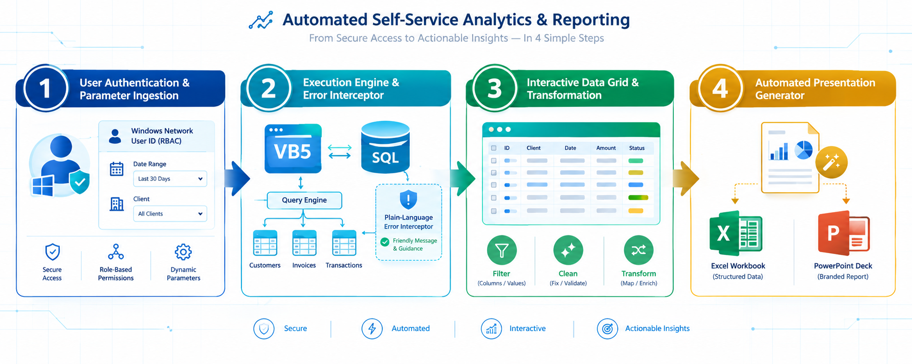
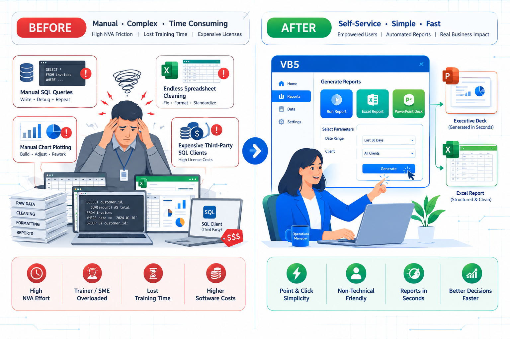

# 🛠️ Project 17: Solution Wizard — Self-Service SQL Analytics & Automated Executive Reporting Platform

## Executive Overview:

* **Enterprise Context:** GE Capital International Services (GECIS) — Cendant Mobility Services (Global Relocation & Employee Mobility Operations)
* **Role:** Lead Automation Software Engineer & SDLC Owner (eLab's)
* **Core Value Delivered:** Concepted, engineered, deployed, and maintained **Solution Wizard** as part of a formal Six Sigma Green Belt DMAIC initiative. Built a single-screen Visual Basic (VB5) self-service analytics and automated reporting engine directly connected to back-end SQL databases. Replaced manual SQL query construction, data cleaning, graph generation, and PowerPoint deck populating with a point-and-click interface — eliminating 80%+ of SME data analytics workload and enabling non-technical operation managers to generate on-demand analytics without writing a single line of SQL.
* **Impact & Key Deliverables:**
  * **>80% SME Workload Reduction:** Freed a senior SME/process trainer from full-time manual data manipulation, redirecting their expertise back to training, coaching, and onboarding newly inducted internal auditors.
  * **Direct License Cost Avoidance:** Completely eliminated the need for third-party SQL client software licenses across local operations managers, generating recurring monthly software cost savings for the Cendant account.
  * **Automated Data Pipeline & Deck Generation:** Built a codeless ETL/ELT pipeline that executed parameter-driven queries, cleansed raw data, generated visual infograms, and populated standardised weekly, monthly, and quarterly PowerPoint decks automatically.
  * **Role-Based Security & Human-Readable Error Handling:** Integrated Windows Network User ID access controls to restrict data visibility to authorised tables, and engineered an error interceptor that translated raw back-end SQL errors into plain-language troubleshooting guidance for operational teams.
* **Core Stack:** Visual Basic 5 (VB5 Desktop GUI Engine), T-SQL, Active Data Objects (ADO/ OLEDB), MS Excel Automation API, MS PowerPoint API, Windows Network AD Authentication.

---

## 1. Operational Challenge & Misallocated SME Talent:

### Baseline Operational Friction:

During a Six Sigma Green Belt DMAIC *Define & Measure* phase, a critical operational bottleneck was identified: a senior SME and process trainer was dedicating nearly 100% of their bandwidth to manual data analytics instead of coaching frontline auditors.

```text
┌────────────────────────────────────────────────────────────────────────────────────────┐
│                           BASELINE MANUAL ANALYTICS FRICTION                           │
├────────────────────────────────────────────────────────────────────────────────────────┤
│  • Senior SME Bottleneck: Senior trainer spent full time writing raw SQL queries,      │
│    pulling data, cleaning tables, and manually creating PowerPoint charts.             │
│  • High Dependency & Ad-Hoc Requests: Operations Managers, Assistant Managers, and     │
│    Cendant clients relied exclusively on the SME for routine & ad-hoc reports.         │
│  • Core Role Compromise: Onboarding, mentoring, and quality support for newly inducted │
│    internal auditors suffered due to constant data analytics distractions.             │
│  • Third-Party License Overhead: Operations managers required paid SQL Client licenses │
│    simply to attempt basic data lookups and verification tasks.                        │
└────────────────────────────────────────────────────────────────────────────────────────┘

```

* **High Non-Value-Added (NVA) Overhead:** The senior SME's core mandate was to train and support auditors, but constant requests for weekly/ monthly dashboards and custom client cuts kept them trapped in spreadsheets and query windows.
* **Lack of Self-Service Capability:** India GECIS Assistant Managers and Process Managers possessed deep Audit/Accounting domain knowledge, but lacked SQL query writing and ETL capabilities, creating an absolute person-dependency on the SME.

---

## 2. Solution Architecture & Automated ETL Pipeline:
Collaborating as the lead developer during the *Analyse & Improve* stages of the Green Belt project, I architected **Solution Wizard** to bridge the gap between complex SQL databases and non-technical operational users:



```text
┌────────────────────────────────────────────────────────────────────────────────────────┐
│                         SOLUTION WIZARD ARCHITECTURE PIPELINE                          │
│  ┌─────────────────────────┐   ┌───────────────────────────┐   ┌────────────────────┐  │
│  │ 1. Network User-ID      │   │ 2. Pre-Loaded & Parameter │   │ 3. Automated Error │  │
│  │    Authentication & RBAC│   │    SQL Query Engine       │   │    Translator      │  │
│  └────────────┬────────────┘   └─────────────┬─────────────┘   └─────────┬──────────┘  │
└───────────────┼──────────────────────────────┼───────────────────────────┼─────────────┘
                │                              │                           │
                └─────────────────────────────┬┴───────────────────────────┘
                                              ▼
┌────────────────────────────────────────────────────────────────────────────────────────┐
│                   SOLUTION WIZARD CORE ENGINE (VB5/ ADO/ T-SQL)                        │
├────────────────────────────────────────────────────────────────────────────────────────┤
│  • Dynamic Parameter Ingestion (Dates, Client, User, Contract, Payment Terms)          │
│  • Interactive Visual Data Grid & In-Line Data Massaging/ Cleaning                     │
│  • Automated Graph Rendering & Presentation Automation Engine                          │
└─────────────────────────────────────────────┬──────────────────────────────────────────┘
                                              ▼
┌────────────────────────────────────────────────────────────────────────────────────────┐
│                       AUTOMATED SELF-SERVICE OUTPUT MODULES                            │
├────────────────────────────────────────────────────────────────────────────────────────┤
│ • On-Screen Interactive Grid  • Formatted MS Excel Exports   • Automated PPT Decks     │
└────────────────────────────────────────────────────────────────────────────────────────┘

```

### Technical Component Breakdown:

1. **RBAC & Network User-ID Authenticator:** Queried active Windows Network User-IDs to automatically evaluate database and table permissions, ensuring managers only accessed data matching their security scope.
2. **Dynamic Parameter Query Engine:** Stored pre-approved SQL queries created jointly by the SME and technology team. Allowed non-technical users to inject adhoc values for runtime variables — for e.g., `From Date`, `To Date`, `Client Name`, `User Name` (auditor productivity/ quality), `Contract Type`, and `Payment Terms`.
3. **In-Line Data Massaging & Transformation:** Provided a visual interface to apply data cleaning rules, filter records, and format output before extracting or exporting.
4. **Presentation & Deck Automation API:** Integrated COM interfaces for MS Excel and MS PowerPoint to automatically construct graphs, populate tables, and generate executive decks without manual copy-pasting.
5. **Plain-Language Error Interceptor:** Trapped raw back-end database exception codes and rendered them into clear, layman's terms so operational leads could resolve input mistakes independently.

---

## 3. Single-Screen Integrated UI Modules:

### Module 1: Pre-Loaded Query & Variable Ingestion Engine
* **Features:** Drop-down repository covering 80%+ of all routine operational and client reports. Features intuitive input fields for dynamic parameters (date ranges, clients, contracts, payment terms).
* **Impact:** Eliminates raw SQL writing while retaining high flexibility for varied report cuts.

### Module 2: Interactive Data Grid & Cleansing Suite
* **Features:** Tabular, Excel-like grid displaying query results directly within the application. Includes built-in options for data transformation, filtering, and pre-export validation.
* **Impact:** Allows managers to inspect and sanitise data before exporting, preventing flawed metrics from reaching leadership.

### Module 3: SQL Editor & Query Maintenance Portal (Admin View)
* **Features:** A secure, embedded query management module accessible by authorised SMEs and admins. Enables adding, updating, or tuning SQL queries directly within the UI.
* **Impact:** Removed the need for an external SQL Client tool, allowing the SME to maintain query logic easily when new ad-hoc requirements arose.

### Module 4: Automated Deck & Chart Generator
* **Features:** Point-and-click exporter that pushes processed data into pre-formatted MS Excel workbooks and populates structured PowerPoint presentation decks.
* **Impact:** Standardised weekly, monthly, and quarterly client review decks, eliminating hours of manual formatting work.

---

## 4. Measurable Business Results & Operational Impact:



| Performance Metric | 🛑 Baseline State (Pre-Solution Wizard) | 🎯 Post-Deployment State (Solution Wizard) | 💡 Strategic Value |
| --- | --- | --- | --- |
| **SME Capacity Allocation** | ~100% time spent on queries & decks | **>80% Workload Reduction** | Reallocated senior SME talent back to auditor coaching & training |
| **User Dependency** | Total reliance on 1 senior SME | **100% Self-Service for Ops Managers** | Enabled codeless, point-and-click analytics across all GECIS leads |
| **Software Cost Avoidance** | Paid SQL Client licenses per user | **100% SQL Client Licenses Sunset** | Delivered direct, recurring monthly software cost savings for Cendant |
| **Report Standardisation** | Fragmented spreadsheets & manual charts | **Automated PowerPoint & Excel Decks** | Guaranteed 100% consistent executive and client presentation formats |
| **Error Resolution** | Cryptic SQL error codes required tech support | **Plain-Language Error Translation** | Enabled instant self-correction of input errors by floor managers |

---

## 5. Key Competencies Demonstrated:

* **Full-Stack SDLC Architecture & Development:** Designing, coding, documenting, and maintaining desktop software applications in VB5, ADO, and SQL.
* **Six Sigma Green Belt DMAIC Execution:** Partnering with process owners during *Analyse*, *Improve*, and *Control* phases to systematically eliminate operational non-value-added work.
* **Office Automation & Presentation Engineering:** Leveraging MS Excel and PowerPoint APIs to automate complex chart generation and executive deck assembly.
* **Usage Telemetry & Control Governance:** Building back-end telemetry to track query execution, user activity, tool performance, and error rates to sustain long-term adoption.

---
