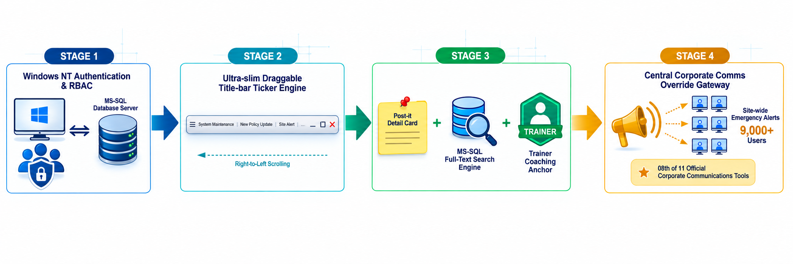
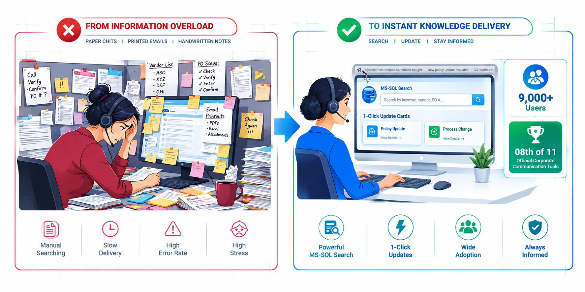

# 🛠️ Project 20: Anukāra — Enterprise Knowledge Ticker & Emergency Communication Platform

## Executive Overview:

* **Enterprise Context:** GE Capital International Services (GECIS) — Enterprise-Wide Deployment (Hyderabad & Chandigarh Sites)
* **Role:** Product Manager, Lead Software Architect, Grassroots Marketer & SDLC Owner (Citizen Developer)
* **Origin & Product Philosophy:** Born out of personal operational friction as an internal auditor/ operations rep struggling to retain fast-changing process updates from daily stand-ups. The core idea was to eliminate physical floor clutter—where agents taped handwritten chits, printed emails, and cheat-sheets around their monitors. Named Anukāra (Sanskrit for "that which imitates or resembles"), designed to replicate a digital, searchable memory bank for frontline agents.
* **Core Value Delivered:** Engineered a non-intrusive, ultra-slim (0.5cm x ~06 inches) persistent desktop ticker app. Designed with a neutral gray/ standard background that blended seamlessly into standard MS application title bars (preventing eye-strain), it allowed users to freely drag and anchor the ticker anywhere on their screen. Powered by a high-concurrency **MS-SQL database backend** with a VB5 client GUI, it delivered real-time, RBAC - filtered process updates, a "Google-like" full-text search archive, and emergency broadcasting capabilities — growing via a one-man-army grassroots marketing push to **9,000+ active users** and securing recognition as **the 8th out of 11 official recognised corporate communication tools** across GECIS.
* **Impact & Key Deliverables:**
  * **9,000+ Active Enterprise Users:** Scaled across all operational teams in GECIS Hyderabad and Chandigarh through relentless one-man-army floor marketing, overcoming initial resistance to limited real estate on user screens.
  * **Selected as 8th of 11 Official Corporate Comm Tools:** Formally vetted, live-tested, and recognised by Central & Local Corporate Communications to push GECIS-wide announcements, policy updates, and emergency alerts.
  * **Single Point of Truth for Coaching & Audit Alignment:** Served as the concrete reference point for trainers, leads, and reps during error coaching sessions—verifying exact update dates, applicability, and rule versions.
  * **High-Concurrency VB5/ MS-SQL Architecture:** Separated client-side VB5 rendering logic from a centralised MS-SQL database to support 9,000+ concurrent user connections without performance degradation.
  * **User-Centric Draggable Anchor UI:** Allowed agents to anchor the 0.5 cm ticker to top application title bars or freely drag and position it anywhere on their desktop workspace.
* **Core Stack:** Visual Basic 5 (VB5 Client GUI & Dynamic Draggable Windows API Hooks), MS-SQL Server (Centralised High-Concurrency RDBMS & Full-Text Search Engine), Windows NT Network Authentication/ RBAC, Custom Title-Bar Anchoring & System Tray Drivers.

---

## 1. Operational Friction & Product Philosophy:

### The Human Pain Point (Physical Cubicle Clutter):
In high-volume Business Process Outsourcing (BPO) operations, trainers and team leads shared critical process changes during short morning stand-up meetings. To cope with memory overload, agents resorted to handwriting paper chits and taping printed emails around their computer monitors and cubicle walls.

```text
┌──────────────────────────────────────────────────────────────────────────────────────────┐
│                              BASELINE MANUAL KNOWLEDGE FRICTION                          │
├──────────────────────────────────────────────────────────────────────────────────────────┤
│  • Physical Paper Clutter: Cubicle walls and monitor frames were plastered with paper    │
│    chits and printed cheat-sheets, quickly running out of physical space.                │
│  • High Search Friction: Finding a specific update meant manually digging through        │
│    taped papers and printed notes while handling active processing calls/ transactions.  │
│  • Outdated Rules & Defect Risk: Taped chits were often superseded by new rules, leading │
│    to agents processing transactions using outdated physical notes (audit findings).     │
│  • Coaching Ambiguity: Lacked a single point of reference when trainers and reps         │
│    dissected processing errors or quality non-conformances.                              │
└──────────────────────────────────────────────────────────────────────────────────────────┘
```

### The Product Mindset & "Copycat Award" Spirit:
* **Inspired Best-Practice Replication:** Leveraged GECIS's "Copycat Award" philosophy — borrowing user-friendly UI patterns from external tools and adapting them for enterprise operations.
* **Neutral Gray Title-Bar Integration:** Styled with a neutral gray palette that matched standard Windows application title bars, scrolling updates gently right-to-left to ensure zero eye fatigue or operational distraction.
* **Flexible Draggable Anchoring:** While defaulted to application title bars, agents could drag, dock, or anchor the ticker anywhere on their desktop to suit individual ergonomic preferences.

---

## 2. System Architecture & High-Concurrency Split:



```text
┌────────────────────────────────────────────────────────────────────────────────────────┐
│                        ANUKĀRA ENTERPRISE TICKER PIPELINE                              │
├────────────────────────────────────────────────────────────────────────────────────────┤
│  ┌──────────────────────────┐                      ┌────────────────────────────────┐  │
│  │ Windows NT Login / RBAC  │                      │  Central MS-SQL Server RDBMS   │  │
│  │ (Agent ID, LE, Process)  │                      │ (High-Concurrency Repository)  │  │
│  └────────────┬─────────────┘                      └──────────────┬─────────────────┘  │
└───────────────┼───────────────────────────────────────────────────┼────────────────────┘
                │                                                   │
                ▼                                                   ▼
┌────────────────────────────────────────────────────────────────────────────────────────┐
│               VB5 CLIENT GUI & DRAGGABLE TITLE-BAR TICKER ENGINE                       │
├────────────────────────────────────────────────────────────────────────────────────────┤
│  • Ultra-Slim Draggable Anchor (0.5cm x ~06 inches) | Seamless Title-Bar Gray Blending │
│  • Smooth Right-to-Left Headline Scroller (Zero eye-strain animation rate)             │
│  • Instant Emergency Flash Interceptor (Site Safety, Fire, Critical Site Broadcasts)   │
└───────────────────────────────────────┬────────────────────────────────────────────────┘
                                        │
                                        ▼
┌────────────────────────────────────────────────────────────────────────────────────────┐
│                     USER INTERACTION & KNOWLEDGE ACCESS LAYERS                         │
├────────────────────────────────────────────────────────────────────────────────────────┤
│  • One-Click Post-It Detail Card (Full Update, Trainer Name, Effective Date, LE/Team)  │
│  • "Google-Like" MS-SQL Full-Text Search (Filter by Date, Keyword, Trainer, Process)   │
│  • Trainer & Rep Coaching Anchor (Verification of exact rules during error reviews)    │
└────────────────────────────────────────────────────────────────────────────────────────┘
```

### Key Architectural Pillars:
1. **Decoupled High-Concurrency Architecture:** Separated light VB5 desktop clients from a central **MS-SQL Server database**, allowing 9,000+ simultaneous agent sessions to query and pull updates in milliseconds without locking backend tables.
2. **Role-Based Publishing & RBAC Targeting:** Restricted update creation, scheduling, and queue selection strictly to authorised process trainers, quality leads, and corporate communications admins.
3. **Draggable Title-Bar UI & Visual Blending:** Programmed low-level Windows API hooks allowing the ticker to sit flush on top application title bars using a non-intrusive gray theme, while giving users total freedom to reposition the window anywhere on screen.
4. **Trainer-Rep Coaching Point of Anchor:** Established a common, auditable baseline for quality coaching. When a transaction error occurred, trainers and reps used Anukāra to verify whether the specific update was active, published, and reviewed on the date in question.
5. **"Google-Like" MS-SQL Full-Text Search Engine:** Integrated an in-app search module connected to MS-SQL full-text indexes, allowing reps to instantly find past updates by typing keywords, dates, trainer names, or process tags.
6. **Corporate Communications Override:** Enabled Central/Local Corp Comms to trigger site-wide emergency broadcasts (fire alerts, site closures, major IT issues) across Chandigarh and Hyderabad screens within seconds.

---

## 3. Core Operational Modules:

* **Module 1: Draggable VB5 Desktop Ticker Engine:** Handles low-CPU right-to-left text scrolling, gray title-bar colour matching, and custom desktop docking logic.
* **Module 2: Trainer & RBAC Publisher Workspace:** Provides authorised trainers and leads with controls to create updates, select daily active queues, set expiration dates, and target specific LEs or teams.
* **Module 3: MS-SQL Powered Knowledge Search Gateway:** Executes rapid full-text queries against the central database, rendering historical process rules on an interactive Post-It style detail card.
* **Module 4: Corporate Comms & Emergency Broadcast Hub:** Grants central communications leads top-level privileges to dispatch urgent site-wide announcements across both facilities.

---

## 4. Measurable Impact & Grass-roots Adoption Curve:


| Operational Dimension | 🛑 Pre-Anukāra State | 🎯 Post-Deployment State (*Anukāra*) | ⚡ Strategic Impact |
| --- | --- | --- | --- |
| **User Adoption & Scale** | Individual process silos | **9,000+ Active Users Across 2 Sites** | Organic, one-man-army grassroots expansion across Hyderabad and Chandigarh. |
| **Enterprise Recognition** | Informal floor workaround | **8th of 11 Official Corporate Comm Tools** | Officially recognised and sanctioned by GECIS Corporate Communications. |
| **System Architecture** | Unstructured physical paper notes | **VB5/ MS-SQL Decoupled Engine** | High-concurrency database handling 9,000+ active connections seamlessly. |
| **Ergonomics & Flexibility** | Fixed paper clutter on monitor bezels | **Draggable 0.5cm Neutral Gray UI** | Blended into title bars with zero eye-strain and full user positioning control. |
| **Coaching & Audit Clarity** | Disputes over verbal/paper updates | **Auditable Single Point of Anchor** | Instant verification of exact process rule versions during error reviews. |
| **Emergency Preparedness** | Slow email/ phone tree chains | **Instant Multi-Site Broadcasts** | Emergency alerts pushed across all 9,000+ screens in seconds. |

---

## 5. Key Leadership & Technical Competencies Demonstrated:

* **Grass-roots Product Marketing & Change Management:** Driving a one-man-army adoption campaign—personally pitching team managers and frontline users, overcoming initial resistance to screen space, and achieving floor-wide viral usage.
* **Continuous Product Maintenance & Ownership:** Serving as the sole developer, maintainer, and feature-enhancer throughout my tenure at GECIS, ensuring 100% uptime for 9,000+ users.
* **High-Concurrency Database Architecture:** Designing a decoupled VB5/ MS-SQL Server architecture tailored for thousands of simultaneous reads and queries.
* **Human-Centered UI/UX Ergonomics:** Crafting non-intrusive micro-interfaces that blend visually into native OS elements while offering flexible user docking preferences.
