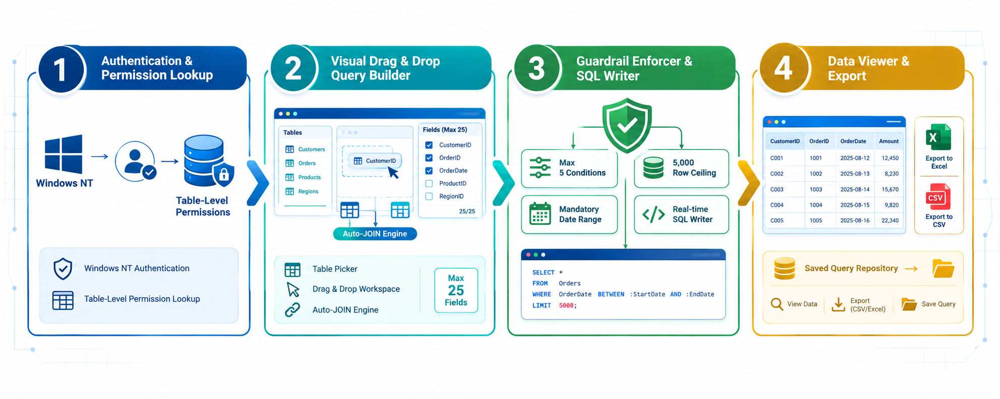
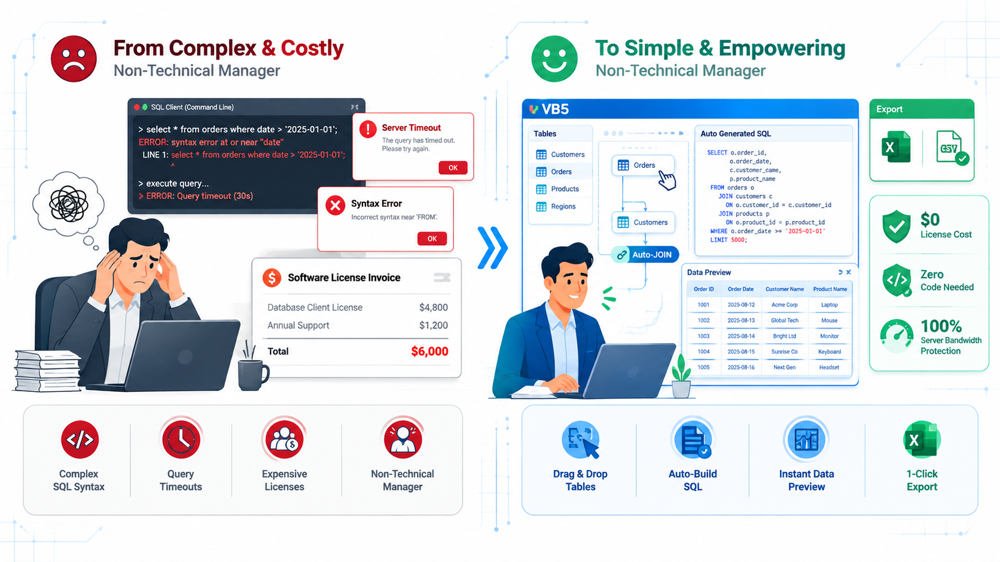

# 🛠️ Project 21: SQL Genie — Drag-and-Drop Visual Query Builder & Data Extraction Engine

## Executive Overview:

* **Enterprise Context:** GE Capital International Services (GECIS) — Cross-Process Migration & Operations (Hyderabad Site)
* **Role:** Product Manager, Lead Software Architect, UI/UX Designer & SDLC Owner (Citizen Developer)
* **Origin & Floor-Level Empathy:** Born out of first-hand operational empathy as a former frontline rep who understood the sheer frustration of retrieving data for client reviews without knowing SQL. Conceived as an ahead-of-its-time, self-service spin-off inspired by **[Project 17: Solution Wizard](https://github.com/Vasanth-Naidu/05-Software-SDLC-Deployment/tree/main/17-Solution-Wizard-Automated-Reporting?utm_source=gemini)**.
* **A Pioneering Pre-BI No-Code Innovation (2001):** Engineered a visual, drag-and-drop SQL query engine years before modern self-service BI platforms (like Tableau or Power BI) existed. Allowed non-technical team leads and managers to visually select databases, drag tables, pick fields, apply comparison filters, auto-generate clean SQL syntax, execute queries, and export results directly to Excel—without writing a single line of code.
* **Core Value Delivered:** Combined visual usability with proactive enterprise infrastructure protection. Built strict backend server guardrails—capping output fields, limiting filter conditions, enforcing mandatory date windows, and imposing row return limits—to protect core production OLTP databases while eliminating third-party SQL client software license fees across newly migrated BPO processes.
* **Impact & Key Deliverables:**
  * **100% No-Code Self-Service Data Mining:** Empowered operational leaders to construct multi-table SQL queries visually, demystifying enterprise databases for non-technical floor staff.
  * **Ingenious Database Infrastructure Protection:** Embedded hard-coded server guardrails that prevented unoptimised, runaway queries from locking database tables or jamming server pipelines.
  * **Significant Software License Savings:** Completely eliminated the need to procure expensive commercial SQL client desktop licenses for operational reporting teams across migrated processes.
  * **Full Lifecycle Query Repository:** Provided an in-app library where managers could store, recall, update, or archive custom query scripts for automated weekly/monthly review decks.
* **Core Stack:** Visual Basic 5 (VB5 Single-Page Drag-and-Drop GUI), MS SQL Server/ Oracle RDBMS Connectors (ADO/OLEDB), Windows NT Authentication & Table-Level RBAC, Dynamic SQL Syntax Engine, In-Memory Tabular Grid & CSV/Excel Export Drivers.

---

## 1. Operational Challenge & The 2001 Self-Service Vacuum:

### Baseline Operational Friction:
In 2001, newly migrated GECIS operational teams faced a major technical hurdle: creating weekly and monthly performance review decks for GE business clients required mining raw data from backend databases.

```text
┌──────────────────────────────────────────────────────────────────────────────────────────┐
│                          BASELINE MANUAL DATA EXTRACTION FRICTION                        │
├──────────────────────────────────────────────────────────────────────────────────────────┤
│  • Lack of SQL Skills: Floor managers and leads had zero formal SQL knowledge, requiring │
│    constant intervention from technical developers or database administrators.           │
│  • High License Costs: Provisioning specialised SQL client software for non-technical    │
│    staff across newly migrated processes was cost-prohibitive.                           │
│  • Server Jamming & Runaway Queries: Hand-written or unoptimised queries created massive │
│    table locks, pipeline bottlenecks, and server timeouts during peak production.        │
│  • Repetitive Manual Work: Teams repeatedly re-created identical ad-hoc queries from     │
│    scratch because no central, process-level query storage existed.                      │
└──────────────────────────────────────────────────────────────────────────────────────────┘
```

* **The "SQL Genie" Magic:** Rooted in the lived experience of floor-level friction, watching *SQL Genie* assemble syntactic SQL `SELECT`, `JOIN`, `WHERE`, and `GROUP BY` statements automatically in real time as users dragged tables felt like pure magic to operational leaders.

---

## 2. System Architecture & Visual Query Assembly Pipeline:

```text
┌────────────────────────────────────────────────────────────────────────────────────────┐
│                      SQL GENIE VISUAL QUERY ASSEMBLY PIPELINE                          │
├────────────────────────────────────────────────────────────────────────────────────────┤
│  ┌──────────────────────────┐                      ┌────────────────────────────────┐  │
│  │  Windows NT Login/ RBAC  │                      │   Database Schema Ingestion    │  │
│  │ (Auth & Table Privileges)│                      │ (Authorised DBs & Tables List) │  │
│  └────────────┬─────────────┘                      └──────────────┬─────────────────┘  │
└───────────────┼───────────────────────────────────────────────────┼────────────────────┘
                │                                                   │
                ▼                                                   ▼
┌────────────────────────────────────────────────────────────────────────────────────────┐
│                   VB5 SINGLE-PAGE VISUAL DRAG-AND-DROP WORKSPACE                       │
├────────────────────────────────────────────────────────────────────────────────────────┤
│  • Step 1: Select Database → Load Tables → Drag & Drop Target Tables                   │
│  • Step 2: Field Picker (Capped at 25 fields max to protect row width)                 │
│  • Step 3: Auto-JOIN & Schema Compatibility Engine (UNION / JOIN validation)           │
│  • Step 4: Visual Filter Builder (Operators: >, =, <, != | Capped at 5 conditions)     │
│  • Step 5: Enforced Server Guardrails (Mandatory Date Range + 5,000 Row Extraction Cap)│
│  • Live SQL Syntax Writer: Real-time SQL statement assembly panel                      │
└───────────────────────────────────────┬────────────────────────────────────────────────┘
                                        │
                                        ▼
┌────────────────────────────────────────────────────────────────────────────────────────┐
│                     EXECUTION, ERROR RECOVERY & REPOSITORY LAYERS                      │
├────────────────────────────────────────────────────────────────────────────────────────┤
│  • Real-Time Progress Bar & In-App Tabular Grid Viewer (Excel-like preview)            │
│  • Smart Timeout & Error Recovery Interceptor (Provides actionable fix popups)         │
│  • One-Click CSV / MS Excel Export & Query Repository (Save / Edit / Archive Queries)  │
└────────────────────────────────────────────────────────────────────────────────────────┘
```

### Key Architectural Pillars & Proactive Infrastructure Guardrails:
1. **NT Authentication & Table-Level Permission Masking:** Automatically queries backend system catalogues upon startup, presenting users only with the specific databases and tables authorised for their NT login ID.
2. **Schema Compatibility & Auto-JOIN Engine:** Intelligently analyses field data types and primary/ foreign key relationships. Automatically constructs mathematically valid `JOIN` or `UNION` clauses while warning users if selected tables cannot be connected.
3. **Proactive Database Guardrails (Server Safety Engine):**
   * **Output Field Cap (Max 25 Fields):** *Built to restrict wide-table row sizes, minimising disk I/O overhead and network payload.*
   * **Filter Condition Cap (Max 05 Conditions):** *Built to prevent overly complex, unindexed logical chains (`OR`/`AND`) from forcing full table scans.*
   * **Mandatory Date/Range Filter Enforcement:** *Built to ensure queries target bounded timeframes (e.g., 30/60/90 days), preventing accidental scans of multi-year historical archives.*
   * **Row Extraction Ceiling (`TOP 5000` Cap):** *Built to cap memory consumption on `TempDB` buffers and prevent client-side VB5 UI grid freezing.*
4. **Interactive In-App Grid & Error Interceptor:** Displays execution progress bars and renders results directly in an embedded, Excel-like grid. If a query times out or encounters a syntax error, *SQL Genie* traps the error and suggests concrete troubleshooting steps.
5. **Full Lifecycle Query Repository:** Allows managers to save custom queries to an internal library, load pre-written extractions for recurring weekly reviews, modify parameters, or archive obsolete scripts.

---

## 3. Core Operational Modules:

* **Module 1: Drag-and-Drop Canvas & Live SQL Generator:** Renders database schemas and assembles formatted SQL statements dynamically as users select tables and fields.
* **Module 2: Schema Compatibility & Validation Engine:** Checks data types and table relationships to ensure valid `JOIN` logic and prevents incompatible union attempts.
* **Module 3: Infrastructure Protection & Guardrail Enforcer:** Automatically applies the 25-field cap, 05-condition limit, mandatory date range boundary, and 5,000-row extraction ceiling before sending statements to the server.
* **Module 4: Query Execution & Progress Monitor:** Manages asynchronous database queries, displays visual progress bars, and traps timeout exceptions with corrective user prompts.
* **Module 5: Tabular Data Viewer & Query Repository:** Renders outputs on an interactive grid, enables 1-click CSV/Excel exports, and manages saved query libraries.

---

## 4. Measurable Impact & Operational Value Delivered:

| Operational Dimension | 🛑 Baseline State (Pre-SQL Genie) | 🎯 Post-Deployment State (*SQL Genie*) | ⚡ Strategic Impact |
| --- | --- | --- | --- |
| **SQL Technical Barrier** | Manual coding required by DBAs/Devs | **100% No-Code Drag-and-Drop** | Enabled non-technical operational leads to extract data independently. |
| **Software Procurement** | Expensive SQL Client desktop licenses | **$0 License Cost (In-House VB5 Tool)** | Saved substantial license fees across all migrated GECIS processes. |
| **Database Server Health** | Frequent server locks from unindexed queries | **100% Protected Server Bandwidth** | Guardrails ensured primary bandwidth remained dedicated to production OLTP applications. |
| **Query Reusability** | Extractions rebuilt manually every time | **Centralised Saved Query Repository** | Enabled instant execution of saved queries for weekly/monthly review decks. |
| **Data Export Velocity** | Complex copy-pasting from query tools | **One-Click Direct CSV/Excel Export** | Streamlined review deck creation for GE business stakeholders. |

---

## 5. Key Leadership & Technical Competencies Demonstrated:

* **Ahead-of-Its-Time Citizen Developer Innovation (2001):** Conceptualising and delivering a visual, drag-and-drop no-code query builder years before modern commercial BI platforms existed.
* **Empathetic, Floor-Rooted Problem Solving:** Channelling personal frontline experience to eliminate technical barriers for non-technical operational peers.
* **Proactive Infrastructure Protection:** Engineering built-in safety caps (field, condition, date, and row limits) to balance user analytical freedom with strict enterprise database health.
* **Enterprise Software Cost Optimisation:** Replacing costly third-party commercial software with custom, lightweight internal solutions.

---
